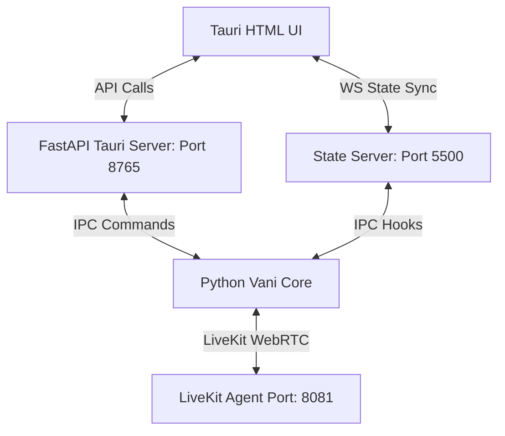

# Vani: Deep Technical & Architectural Reference Manual
## End-to-End Capabilities, Tools, Schemas, and System Internals (Small to Big)

Vani is a local-first, voice-activated autonomous Agent Operating System (OS). This manual catalogs every single package, module, class, database schema, background worker thread, environment key, and tool function (from low-level key bindings to multi-agent loops) configured in the codebase.

---

## 📂 Codebase Directory Map & File Index

| Directory / File Path | Description |
| :--- | :--- |
| `src/vani/app.py` | Main application server containing LiveKit entrypoint (`entrypoint`), HTTP route handlers, FastAPI backend routes, and server loops. |
| `src/vani/config.py` | Configures system paths (`PROJECT_ROOT`, `ASSETS_ROOT`, `CONVERSATIONS_DIR`, `VOICEPRINT_PATH`, `BOOK_MEMORY_DIR`) and parses environment variable types. |
| `src/vani/launcher.py` | Focuses windows, sets up the system tray icons (via pystray + Pillow), listens for global hotkeys (via pynput), and launches Python background processes. |
| `src/vani/security_state.py` | Implements tool sandboxing categories (`SAFE`, `CONFIRM_REQUIRED`, `SANDBOXED`), audit logging (writing to `audit_log.jsonl`), and strict Hinglish security verification flow. |
| `src/vani/name_pronunciation.py` | Manages phonetics and Devanagari pronunciation maps (`pronunciation_cache.json`) for natural name speech in Hinglish. |
| `src/vani/voice_security_prompt.py` | Context rules injected during low voiceprint similarity matches, prompting 6 verification questions. |
| `src/vani/wake_listener.py` | Always-on background voice spotter (VOSK / NSSpeechRecognizer) and energy double-clap detector callback loops. |
| `src/vani/core/cache.py` | LRU Cache Manager with custom TTL configurations. |
| `src/vani/core/multimodal.py` | Classifies and processes uploaded files (PDFs, Images, Audio, Video) using domain experts. |
| `src/vani/core/observability.py` | Observability trackers monitoring task success, latency, and estimated token costs. |
| `src/vani/core/self_improvement.py` | Post-task agent reflection loops that log UUID suggestions to `improvement_suggestions.jsonl` for human-approval strategies. |
| `src/vani/core/runtime.py` | Manages worker queues, task threads, and LiveKit session references. |
| `src/vani/memory/human_memory.py` | Temporary document databases (outline generation and content injection) and permanent preferences storage. |
| `src/vani/memory/vector_store.py` | Self-contained SQLite vector store running local Ollama embeddings (`nomic-embed-text`). |
| `src/vani/memory/working_memory.py` | Persistent reminders, working files, and active topics saved in `vani_working_memory.json`. |
| `src/vani/memory/book_memory.py` | Extends vector stores for long documents and PDF Q&A fallback modes. |
| `src/vani/reasoning/worker.py` | Task queues, main worker threads, and voice speech acknowledgments. |
| `src/vani/workers/` | Spawns background worker threads (`reminder_worker.py` and `maintenance_worker.py`). |
| `src/vani/plugins/builtin/` | Extends reasoning via Diagrams, Excel spreadsheets, Obsidian vaults, and Whiteboards. |

---

## 🔌 System Port Allocations & Network Interface

Vani operates over three internal network ports to separate state synchronization, user interfaces, and background tasks:



1. **Port 5500 (`ThreadingHTTPServer` / WebSocket Server)**:
   * Serves static assets for the client interface.
   * Manages a thread-safe WebSocket broadcast group (`_ws_clients`) to sync UI state changes (speaking, listening, thinking, clear chat).
2. **Port 8765 (`FastAPI` / `uvicorn` Tauri API)**:
   * Handles IPC requests from the Tauri Rust layer (quit, minimize, wake triggers, and status checks).
3. **Port 8081 (`LiveKit` WebRTC Agent)**:
   * Handshakes WebRTC audio streams, runs Voice Activity Detection (VAD) models (Silero VAD), and connects with Google Gemini Realtime.

---

## 💾 SQLite Schemas & Persistent Data Systems

Memory layer databases are written to the `conversations/` workspace directory:

### 1. SQLite Database: `conversations/vani_human_memory.sqlite3`

#### Table: `temp_documents`
Stores temporary metadata and outline extractions for document ingestion:
```sql
CREATE TABLE temp_documents (
    id TEXT PRIMARY KEY,
    filename TEXT NOT NULL,
    full_text TEXT NOT NULL,
    outline TEXT DEFAULT '',
    user_prompt TEXT DEFAULT '',
    digest TEXT,
    created_at INTEGER NOT NULL,
    expires_at INTEGER NOT NULL,
    char_count INTEGER NOT NULL,
    chunk_count INTEGER NOT NULL
);
```

#### Table: `temp_document_chunks`
Stores text segments of documents indexed for overlap retrievals:
```sql
CREATE TABLE temp_document_chunks (
    document_id TEXT NOT NULL REFERENCES temp_documents(id) ON DELETE CASCADE,
    chunk_id INTEGER NOT NULL,
    text TEXT NOT NULL,
    tokens TEXT NOT NULL,
    PRIMARY KEY (document_id, chunk_id)
);
```

#### Table: `permanent_memories`
Stores permanent facts and preferences:
```sql
CREATE TABLE permanent_memories (
    id TEXT PRIMARY KEY,
    kind TEXT NOT NULL,
    category TEXT NOT NULL,
    content TEXT NOT NULL,
    raw TEXT DEFAULT '',
    importance INTEGER NOT NULL DEFAULT 5,
    created_at INTEGER NOT NULL,
    updated_at INTEGER NOT NULL
);
```

#### Table: `semantic_memories`
Stores local vector embeddings generated by Ollama (`nomic-embed-text`):
```sql
CREATE TABLE semantic_memories (
    id TEXT PRIMARY KEY,
    content TEXT NOT NULL,
    metadata TEXT,
    embedding TEXT,
    created_at INTEGER NOT NULL
);
```

#### Table: `knowledge_graph` (Knowledge Engine)
Models directed relations, facts, and citation URLs:
```sql
CREATE TABLE IF NOT EXISTS entities (
    name TEXT PRIMARY KEY,
    category TEXT DEFAULT 'general',
    description TEXT,
    created_at INTEGER NOT NULL
);

CREATE TABLE IF NOT EXISTS relations (
    source TEXT REFERENCES entities(name) ON DELETE CASCADE,
    target TEXT REFERENCES entities(name) ON DELETE CASCADE,
    relation_type TEXT NOT NULL,
    confidence REAL DEFAULT 1.0,
    citation_url TEXT,
    created_at INTEGER NOT NULL,
    PRIMARY KEY (source, target, relation_type)
);
```

---

## 🛠️ Reasoning Tools Dictionary (Detailed API Reference)

Vani registers tools inside the LangChain framework to execute commands on the host operating system.

### 📁 Application & OS Controls (`apps.py`)
* `open_application(app_name: str)`: Opens applications on macOS (using AppleScript `tell application "X" to activate`) and Windows (using shell execute).
* `close_application(app_name: str)`: Gracefully terminates applications using command processes (`killall` on Mac, `taskkill` on Windows).
* `switch_application(app_name: str)`: Brings specified apps to the foreground.
* `switch_tab_by_name(query: str)`: Iterates open browser tabs, matching title keywords to bring tabs forward.
* `close_tab_by_name(query: str)`: Closes browser tabs matching title query keywords.
* `close_all_tabs_by_name(query: str)`: Mass-closes open browser tabs matching title queries.
* `close_active_tab()`: Closes the current frontmost browser tab (via key strokes `Cmd+W` / `Ctrl+W`).
* `next_tab()` / `previous_tab()`: Cycles forwards or backwards through browser tabs.
* `app_search(query: str)`: Launches default browsers with search engines.
* `open_url(url: str)`: Opens target links in default browsers.
* `open_url_in_browser(url: str, browser: str)`: Opens urls targeting specific browser engines (Chrome, Safari, Firefox).
* `open_app_smart(app_name: str)`: Intelligent runner resolving spoken name variations.
* `folder_file(command: str)`: Parses file actions (listing directories, opening folders, checking permissions).
* `Play_file(file_path: str)`: Plays files using native system players.
* `move_cursor_tool(x: int, y: int)`: Moves the mouse cursor to screen coordinates.
* `mouse_click_tool(button: str, clicks: int)`: Triggers clicks (left, right, double).
* `scroll_cursor_tool(direction: str, amount: int)`: Scrolls the screen dynamically (up, down, left, right).
* `type_text_tool(text: str)`: Types text strings via keyboard simulation inputs.
* `press_key_tool(key: str)`: Presses specific system keys.
* `press_hotkey_tool(keys: list)`: Executes compound hotkey presses (e.g. `['ctrl', 'shift', 't']`).
* `control_volume_tool(action: str, percent: int)`: Adjusts, mutes, or unmutes audio output volumes.
* `swipe_gesture_tool(direction: str)`: Runs OS-level gestures for scrolling pages.

### 💻 Developer & File Operations (`code.py`)
* `code_assist(command: str, filename: str)`: Write, refactor, and review codes. Employs regex checkouts for Java, HTML, JS, CSS, Python, and SQL scripts. It features a built-in Java loop pattern solver (`_generate_java_loop_pattern`) that dynamically outputs star/digit grid templates.
* `folder_file(command: str)`: Shell operations, directory listings, and permissions verification.

### 💰 Financial Consulting & Yahoo Stock prices (`finance_ca.py`)
* `calculate_tax_ca(income: float, deduclimit: float)`: Performs tax computations under the Indian Income Tax Act (Old vs. New Slabs), factoring standard deductions and Section 80C thresholds.
* `check_compliance_ca(state: str)`: Returns dynamic tax schedules (GST filings, TDS filings, corporate schedules, and due dates).
* `fetch_stock_price(ticker: str)`: Dynamically resolves ticker symbols (Reliance, TCS, Apple) and queries Yahoo Finance's API for real-time pricing, day highs, lows, and trading volume (NSE stocks auto-suffix `.NS`).
* `calculate_mutual_fund_returns(sip: float, rate: float, years: int)`: Projects returns for SIPs and lump-sum investments using compound interest formulas.

### 💼 Jobs Boards (`jobs.py`)
* `search_job_listings(query: str, location: str)`: Searches for career opportunities, salary brackets, and qualifications.

### 🔊 Media Playout (`media.py`)
* `play_media(file_path: str)`: Opens media players to play local audio or video files.

### 💬 Messaging Automation (`messaging.py`)
* `send_whatsapp_message(contact: str, message: str)`: Selects messaging text inputs, formats text, and pastes messages to send WhatsApp chats.
* `send_telegram_message(contact: str, message: str)`: Pastes messages and sends chats over Telegram client handles.
* `read_latest_whatsapp_messages(contact: str)`: Focuses WhatsApp chats and copies messages for text-to-speech feedback.

### 📝 Notes App Integrations (`notes.py`)
* `write_note_in_app(content: str, target_app: str, title: str)`: Adds notes into Apple Notes (via structured AppleScript) or Windows Notepad.
* `write_conversation_to_app(target_app: str, extra_note: str)`: Aggregates conversation histories and pastes them into target applications for future review.

### 🏫 Health & Sex Education (`sex_ed.py`)
* `sex_education(query: str)`: Factual, safe, and supportive health counseling resources.

### 🎓 Study & Focus DND Controls (`study_mode.py`)
* `start_study_session(subject: str, duration_min: int)`: Focus mode. Activates Do Not Disturb (DND) on macOS, closes distracting browser tabs (YouTube, Reddit, Twitter, Facebook), blocks non-essential requests, and monitors focus.
* `end_study_session(reason: str)`: Deactivates DND and restores normal OS execution levels.
* `study_status()`: Outputs current study session metrics, subject targets, and remaining focus time.

### 📺 YouTube Playback Controllers (`youtube.py`)
* `youtube_control(query: str)`: Performs video actions: playing, pausing, resuming, volume adjustments, skipping, fast-forwarding, or speed adjustments.

---

## 🔌 Built-in System Plugins

Plugins extend Vani's workspace tools and integrate directly with UI tabs:

1. **Diagrams (`diagram_plugin.py`)**:
   * Parses structures into Mermaid JS or SVG code blocks to render flowcharts and mindmaps inside UI panes.
2. **Excel Worksheets (`excel_plugin.py`)**:
   * Inspects spreadsheet files (`.xlsx`, `.csv`), performs formula updates (sums, averages, filters), and outputs parsed data grids.
3. **Obsidian Vaults (`obsidian_plugin.py`)**:
   * Syncs conversations, creates markdown files, and manages folders in local Obsidian vaults.
4. **Memory Plugin (`memory_plugin.py`)**:
   * Handles persistent conversational history search triggers and auto-saves sessions to local JSON banks.
5. **Whiteboards (`whiteboard_plugin.py`)**:
   * Renders drawings, flowchart blocks, and brainstorming nodes.

---

## 🏃 Background Thread Workers

Vani manages background worker threads that launch concurrently on boot:

1. **Maintenance Worker (`maintenance_worker.py`)**:
   * Cleans databases periodically (every 12 hours) and purges expired temporary documents (`expires_at <= current_time`).
2. **Reminder Worker (`reminder_worker.py`)**:
   * Checks `vani_working_memory.json` every 30 seconds for pending reminders.
   * On triggers, alerts users by sending browser alerts, writing chat bubbles, and playing speech files.
3. **Worker Manager (`worker_manager.py`)**:
   * Manages worker lifecycles, health stats, and restarts crashed processes.

---

## 🎙️ Wake-up & Startup Memory Reset Sequences

To guarantee Vani never recites stale or lingering memory/document content when starting up or waking up, the memory reset operates end-to-end:

### 1. End-to-End Reset Endpoint (`/wake_reset`)
When `/wake_reset` is triggered via POST request:
1. **Conversation Purge**: Calls `clear_conversation()` in `conversation_writer.py` to reset the chat buffer.
2. **Document Purge**: Calls `clear_active_document()` in `human_memory.py` to delete SQLite rows from `temp_documents` and `temp_document_chunks`, and clears active Gemini Files API URIs.
3. **Working Memory Purge**: Calls `clear_working_memory()` in `working_memory.py` to reset `vani_working_memory.json` to its default blank state.
4. **Semantic Memory Purge**: Calls `SQLiteVectorStore().clear_all()` to delete cached embeddings.
5. **Task Interruption**: Cancels active queue tasks thread-safely via `q.cancel_active_task_threadsafe()`.
6. **LiveKit Interruption**: Schedules an asynchronous `session.interrupt()` to silence ongoing speech.
7. **UI Reset**: Broadcasts `{"action": "clear_chat"}` via WebSockets to empty client-side DOM chat bubbles.

### 2. Double-Clap & Voice Wake Resets
* [wake_listener.py](file:///Users/rudra/Desktop/New%20Vani/src/vani/wake_listener.py) automatically triggers the `/wake_reset` POST request unconditionally for all voice wake-words and double-claps.

### 3. Server Startup Memory Reset
* Integrated the memory reset sequence (conversation, active document, working memory, and semantic vectors) directly into the `main()` function of [app.py](file:///Users/rudra/Desktop/New%20Vani/src/vani/app.py) so that it executes automatically on server launch. This prevents Vani from speaking any old document summaries or reminder briefs when first booted.
